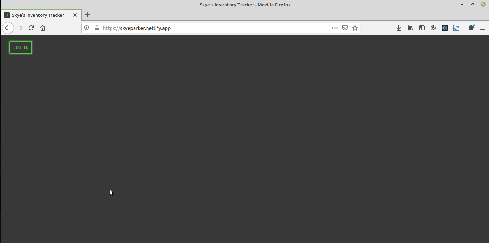

Inventory Tracker App
=====================

About
------------
### Technologies
This app was built using the following tools and technologies (among others):  

* Netlify Serverless 
* FaunaDB Serverless Database
* ReactJS
* Webpack

Run it locally
--------------
To run locally, you will need NPM, which is included with NodeJS and can be downloaded [here](https://nodejs.org/). Additionally, you will need to setup a [Netlify](https://www.netlify.com/) instance with [identity enabled](https://docs.netlify.com/visitor-access/identity/). Finally, create a new [FaunaDB](https://fauna.com/) database to be used for this app.

1. Clone this repository  
2. Run `npm install` from the root directory  
3. Create a .env file in the root directory containing the following:  
    DB_SERVER_KEY = yourFaunaDbServerKey 
    NETLIFY_URL = yourNewlyCreatedNetlifyUrl  
(I recommend copying these environment variables into your Netlify instance environment variables as well right now:  Settings -> Build & Deploy -> Environment)  
4. Run `npm run dev` to start up the local development server. The app will now be available at [localhost:8080](http://localhost:8080/).   
Note that database API requests are being proxied through localhost:9000 when running locally.

Try it out
----------
A functionally limited demo version is hosted at [skyeparker.netlify.app](https://skyeparker.netlify.app).

Why
---
I built this for a friend who wanted a small app to keep track of their medical inventory.

Demo
----

